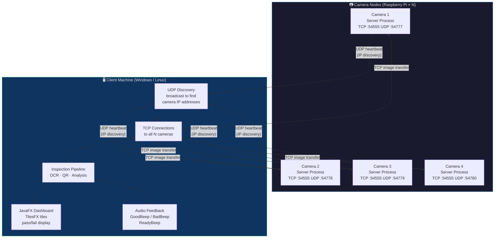
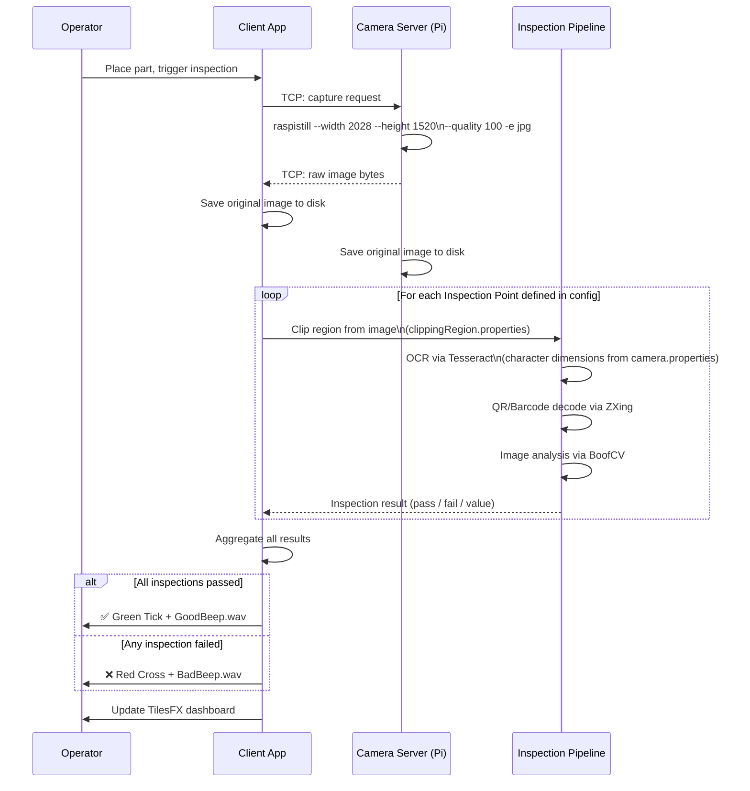
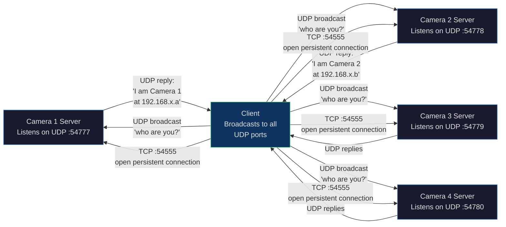

# RemoteCamera
Remote Camera

# 📷 RemoteCamera

> A distributed industrial machine vision system built on networked Raspberry Pi cameras — capturing high-resolution images, running automated visual inspection pipelines (OCR, QR/barcode decoding, image analysis), and presenting results to a central client with real-time audio-visual feedback.

---

## 🔍 What it does

RemoteCamera deploys multiple Raspberry Pi camera nodes across a manufacturing or inspection environment. Each camera node runs as a TCP/UDP server. A central client machine connects to all nodes simultaneously, triggers captures, and receives images for automated inspection.

| Capability | Detail |
|---|---|
| 📡 **Distributed capture** | Up to N cameras, each on its own Raspberry Pi, discovered dynamically via UDP broadcast — no hard-coded IP addresses needed |
| 🔎 **OCR inspection** | Tesseract-powered text recognition on configurable clipping regions of each image |
| 📦 **QR / Barcode decoding** | ZXing decodes QR codes and barcodes found in captured frames |
| ✂️ **Region of interest clipping** | Per-part, per-inspection-point, per-camera clip boxes defined in config files — polygonal regions supported |
| 🖥️ **JavaFX dashboard** | TilesFX-based live display showing pass/fail status, decoded text, and captured images |
| 🔊 **Audio feedback** | Distinct beeps for ready / pass / fail states |
| 📁 **Image archiving** | Raw images saved to disk on both client and server for audit trail |

---

## 🗺️ System Architecture



---

## 🔄 Inspection Flow



---

## 🌐 Network Discovery

A key design feature: **camera IP addresses are discovered dynamically**, so cameras can be replaced or moved without updating any configuration file.



Each camera has a **unique UDP port** but the same TCP port. The client broadcasts to all known UDP ports, collects replies containing each camera's IP address, then opens a persistent TCP connection for image transfer.

---

## ✂️ Clipping & Region of Interest

Images are not inspected in full — each inspection point targets a precise sub-region of the frame, defined in the properties files.

```
camera.properties:
  AL1.Left IP.Text Inspection.characterDimensions = 19,21
  AL1.Left IP.Text Inspection.thickness = Thick

clippingRegion.properties  (rectangular clip):
  AL1.Left IP.Text Inspection.clipBox = 475,670,860,310
  # format: startX, startY, width, height

clipping.properties  (polygonal clip — for non-rectangular regions):
  AL1.Left IP.Text Inspection 1.1.clipBox = 887,589,781,609,645,708,...
  # format: sequence of (x,y) polygon vertex coordinates
```

This allows the same camera to inspect multiple labelled fields on a part — e.g. a left injection point label and a right injection point label — independently, with different expected character dimensions and font thickness settings for the OCR engine.

---

## 📁 Repository Structure

```
RemoteCamera/
│
├── src/main/                    Java source code (Maven standard layout)
│   └── java/                    Server and client implementations
│
├── lib/                         Local JAR dependencies
├── fonts/                       Custom fonts for the JavaFX UI
│
├── camera.properties            Main configuration:
│                                  cameras.total, tcp.port, udp.port per camera,
│                                  OCR character dimensions per inspection point,
│                                  raspistill capture command, save flags
│
├── clippingRegion.properties    Simple rectangular clip boxes per inspection point
│                                  format: partName.inspectionPoint.processor.clipBox
│                                          = startX,startY,width,height
│
├── clipping.properties          Polygonal clip regions (arbitrary shapes)
│                                  format: vertex sequence (x,y,x,y,...)
│
├── Dockerfile.server            Docker image for the camera server process
│                                  (Oracle Java 7 on Ubuntu base)
│
├── pom.xml                      Maven build file — all dependencies declared here
│
├── GoodBeep.wav                 Audio: inspection passed
├── BadBeep.wav                  Audio: inspection failed
├── ReadyBeep.wav                Audio: system ready / camera initialised
│
├── Green Tick.jpg               UI asset: pass indicator
├── Red Cross.jpg                UI asset: fail indicator
├── Question Mark.jpg            UI asset: pending / initialising state
├── Initialisation.jpg           UI asset: startup splash
│
├── liblept1790.dll              Leptonica native library (Windows, for Tesseract)
└── libtesseract411.dll          Tesseract native library (Windows)
```

---

## 📦 Dependencies

All managed via Maven (`pom.xml`), compiled with Java 13:

| Library | Version | Purpose |
|---|---|---|
| **BoofCV** | 0.37 | Computer vision — image processing, feature detection |
| **Tesseract / Lept4j** | 4.1.1 / 1.14.0 | OCR — text recognition on clipped regions |
| **ZXing** | 3.4.1 | QR code and barcode decoding |
| **picam** | 2.0.2 | Java API for Raspberry Pi camera module (`raspistill`) |
| **TilesFX** | 11.48 | JavaFX dashboard tiles for live status display |
| **Apache Commons Math** | 3.6.1 | Image geometry / coordinate transforms |
| **FuzzyWuzzy** | 1.3.1 | Fuzzy string matching for OCR result validation |
| **LMAX Disruptor** | 3.4.2 | High-performance inter-thread messaging |
| **Apache Commons Pool** | 2.9.0 | Object pooling for connection/image resources |
| **imgscalr** | 4.2 | Image scaling and resizing |
| **Apache Batik / SVG** | 1.14 | SVG rendering for UI graphics |
| **Log4j 2** | 2.14.1 | Structured logging on both server and client |
| **TwelveMonkeys ImageIO** | 3.6.x | Extended image format support |

---

## ⚙️ Configuration

### `camera.properties` — core settings

```properties
# Total cameras deployed
cameras.total=4

# TCP port (same on all cameras — each has a different IP)
tcp.port=54555

# UDP discovery ports — MUST be unique per camera
1.udp.port=54777
2.udp.port=54778
3.udp.port=54779
4.udp.port=54780

# Connection timeout
timeout.millis=5000

# Save raw images on both sides for audit
save.original.client=true
save.original.server=true

# Tesseract data path
tesseract.datapath=<path to tessdata>

# Use picam Java API instead of system call (set false to use cameracommand)
use.capricam=true

# raspistill capture command (used when use.capricam=false)
cameracommand=sudo raspistill --width 2028 --height 1520 --nopreview -t 100 --quality 100 -e jpg -th none

# OCR hints per inspection point
# format: {partName}.{inspectionPoint}.{processor}.characterDimensions=width,height
AL1.Left IP.Text Inspection.characterDimensions=19,21
AL1.Left IP.Text Inspection.thickness=Thick
```

### `clippingRegion.properties` — rectangular ROIs

```properties
# format: {part}.{inspection point}.{processor}.clipBox = startX,startY,width,height
AL1.Left IP.Text Inspection.clipBox=475,670,860,310
AL1.Right IP.Text Inspection.clipBox=100,620,690,290
```

### `clipping.properties` — polygonal ROIs

```properties
# format: {part}.{inspection point}.{processor}.clipBox = x1,y1,x2,y2,...
# Used when the region of interest is not rectangular
AL1.Left IP.Text Inspection 1.1.clipBox=887,589,781,609,645,708,...
```

Inspection point names follow a consistent hierarchy:
```
{Part Name} . {Inspection Point Name} . {Processor Name}
    AL1           Left IP               Text Inspection
```

---

## 🚀 Build & Run

### Prerequisites

- **Java 13+** and **Maven 3.x**
- **Raspberry Pi** with Camera Module V2 (server nodes)
- **Tesseract language data** (`tessdata/` folder with trained models)

### Build

```bash
mvn clean package
```

### Run the server (on each Raspberry Pi)

```bash
java -jar RemoteCamera-1.0-SNAPSHOT.jar currentCameraID=1
# Replace 1 with the camera's ID number (1, 2, 3, 4...)
```

Each server process:
1. Starts listening on its unique UDP port for discovery broadcasts
2. Starts listening on the shared TCP port for image requests
3. Plays `ReadyBeep.wav` when initialised

### Run the client (on the inspection workstation)

```bash
java -jar RemoteCamera-1.0-SNAPSHOT.jar
```

The client:
1. Broadcasts UDP discovery messages to all configured UDP ports
2. Collects camera IP addresses from the replies
3. Opens TCP connections to all cameras
4. Opens the JavaFX inspection dashboard

### Deploy the server via Docker

```bash
docker build -f Dockerfile.server -t remotecamera-server .
docker run remotecamera-server java -jar RemoteCamera.jar currentCameraID=1
```

---

## 🖥️ Dashboard States

| Image | State | Audio |
|---|---|---|
|  | Initialising — connecting to cameras | — |
|  | Waiting for part / capture in progress | — |
|  | **PASS** — all inspections passed | `GoodBeep.wav` |
|  | **FAIL** — one or more inspections failed | `BadBeep.wav` |
